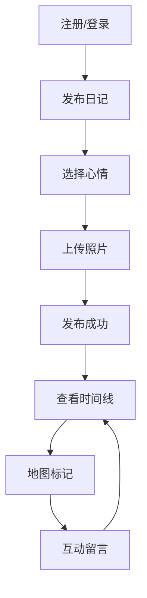

## 1. 产品概览
旅行心情日记是一款记录旅行体验、分享心情的全平台应用，支持多设备同步和离线访问。
- 主要功能包括日记发布、心情记录、照片上传、地图标记和社交互动，帮助用户记录和分享旅行中的美好瞬间。
- 目标用户为热爱旅行、喜欢记录生活的人群，提供便捷的方式记录旅行体验和分享心情。

## 2. 核心功能

### 2.1 用户角色
| 角色 | 注册方式 | 核心权限 |
|------|---------------------|------------------|
| 普通用户 | 邮箱注册 | 发布日记、上传照片、留言互动、查看动态 |

### 2.2 功能模块
1. **首页**：时间线、动态列表、下拉刷新
2. **地图页**：旅行足迹、地图标记、地点相册
3. **发布页**：日记编辑、心情选择、照片上传
4. **消息页**：通知中心、留言提醒
5. **个人页**：个人信息、日记管理、头像设置

### 2.3 页面详情
| 页面名称 | 模块名称 | 功能描述 |
|-----------|-------------|---------------------|
| 首页 | 时间线 | 展示所有公开日记，每篇包含用户头像、昵称、心情图标、文字、照片、发表时间、留言数，支持下拉刷新和滚动加载 |
| 首页 | 导航栏 | 顶部导航栏，包含搜索、通知图标，底部固定导航栏（首页、地图、发布、消息、我的） |
| 地图页 | 地图展示 | 使用 Leaflet 显示地图，以用户当前定位为中心，显示标记点和相册 |
| 地图页 | 标记功能 | 支持长按（移动端）或右键（PC端）添加标记，创建旅行相册或上传照片 |
| 地图页 | 标记列表 | 底部显示已标记地点的缩略列表，可快速滑动定位 |
| 发布页 | 编辑器 | 全屏文本编辑器，支持5000字输入，自动滚动适配键盘 |
| 发布页 | 心情选择 | 提供6种情绪图标（开心、难过、平静、兴奋、疲惫、感恩），大按钮网格排列 |
| 发布页 | 照片上传 | 支持多图上传（最多20张），分片上传，显示进度条，支持暂停/续传 |
| 消息页 | 通知列表 | 显示留言通知，带红点标记未读消息 |
| 个人页 | 个人信息 | 显示头像、昵称、简介、日记总数、到过的地区数量，支持头像上传 |
| 个人页 | 日记管理 | 展示个人发布的所有日记，支持编辑和删除 |
| 日记详情页 | 内容展示 | 完整显示日记内容、照片、心情，支持图片放大查看 |
| 日记详情页 | 留言功能 | 底部固定留言输入框，支持回复特定留言，键盘弹出时自动上移 |

## 3. 核心流程
用户注册/登录 → 发布日记（选择心情、上传照片） → 查看时间线 → 地图标记旅行地点 → 互动留言

## 4. 用户界面设计
### 4.1 设计风格
- 主色调：#3b82f6（蓝色）、#10b981（绿色）
- 辅助色：#f59e0b（橙色）、#ef4444（红色）
- 按钮风格：圆角按钮，有轻微阴影和点击动画
- 字体：系统默认字体，标题18-24px，正文16px，辅助文字14px
- 布局风格：卡片式布局，顶部导航栏，底部固定导航栏
- 图标风格：使用简洁的线性图标和emoji表情

### 4.2 页面设计概览
| 页面名称 | 模块名称 | UI元素 |
|-----------|-------------|-------------|
| 首页 | 时间线 | 卡片式设计，每篇日记为一个卡片，包含用户头像、昵称、心情图标、文字（长文折叠）、九宫格照片、发表时间、留言数，支持下拉刷新和滚动加载动画 |
| 地图页 | 地图展示 | 全屏地图，标记点使用自定义图标，不同颜色区分不同地区，点击标记弹出照片缩略图浮层 |
| 发布页 | 编辑器 | 全屏文本输入区域，顶部工具栏，底部心情选择和照片上传区域，发布按钮固定在底部 |
| 个人页 | 个人信息 | 顶部头像（可点击上传），下方个人信息卡片，日记列表使用网格布局 |
| 日记详情页 | 内容展示 | 顶部返回按钮，中间内容区域，底部留言输入框，支持图片双指缩放和左右滑动切换 |

### 4.3 响应性
- 移动优先设计，适配375px宽度屏幕
- 触摸优化，所有交互元素尺寸≥44x44px
- 底部导航栏适配iPhone底部安全区
- 键盘弹出时自动调整布局，确保输入框可见
- 图片懒加载，使用WebP格式优化加载速度

### 4.4 3D场景指导（不适用）
- 本项目不包含3D场景