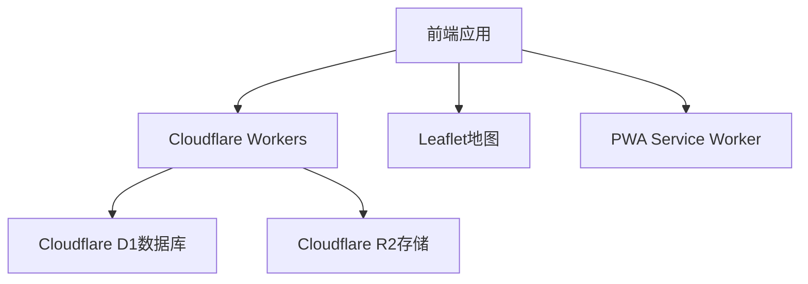
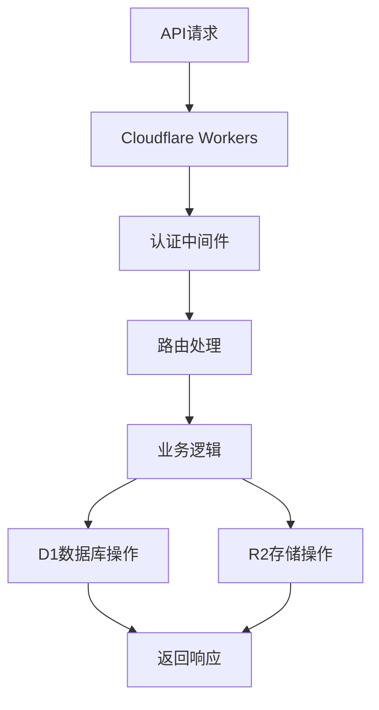

## 1. 架构设计


## 2. 技术描述
- 前端：React@18 + Vite + Tailwind CSS + PWA
- 初始化工具：Vite
- 后端：Cloudflare Workers
- 数据库：Cloudflare D1（SQLite）
- 存储：Cloudflare R2
- 地图：Leaflet + OpenStreetMap
- 认证：JWT

## 3. 路由定义
| 路由 | 用途 |
|-------|---------|
| / | 首页时间线 |
| /map | 旅行地图 |
| /publish | 发布日记 |
| /notifications | 消息通知 |
| /profile | 个人主页 |
| /diary/:id | 日记详情 |
| /login | 登录页 |
| /register | 注册页 |

## 4. API定义
### 4.1 认证API
- POST /api/auth/register - 用户注册
- POST /api/auth/login - 用户登录
- POST /api/auth/refresh - 刷新JWT令牌

### 4.2 日记API
- GET /api/diary - 获取日记列表
- POST /api/diary - 创建日记
- GET /api/diary/:id - 获取日记详情
- PUT /api/diary/:id - 更新日记
- DELETE /api/diary/:id - 删除日记

### 4.3 照片API
- POST /api/upload/init - 初始化分片上传
- POST /api/upload/complete - 完成分片上传
- GET /api/photos/:id - 获取照片信息

### 4.4 地图API
- GET /api/locations - 获取用户标记的位置
- POST /api/locations - 创建位置标记
- GET /api/locations/:id - 获取位置详情

### 4.5 留言API
- GET /api/comments/:diaryId - 获取日记留言
- POST /api/comments - 创建留言
- POST /api/comments/:id/reply - 回复留言

## 5. 服务器架构图


## 6. 数据模型
### 6.1 数据模型定义


### 6.2 数据定义语言
#### 用户表 (users)
```sql
CREATE TABLE IF NOT EXISTS users (
    id INTEGER PRIMARY KEY AUTOINCREMENT,
    email TEXT UNIQUE NOT NULL,
    password_hash TEXT NOT NULL,
    nickname TEXT NOT NULL,
    bio TEXT,
    avatar_url TEXT,
    created_at TIMESTAMP DEFAULT CURRENT_TIMESTAMP,
    updated_at TIMESTAMP DEFAULT CURRENT_TIMESTAMP
);
```

#### 日记表 (diary_entries)
```sql
CREATE TABLE IF NOT EXISTS diary_entries (
    id INTEGER PRIMARY KEY AUTOINCREMENT,
    user_id INTEGER NOT NULL,
    content TEXT NOT NULL,
    mood_id INTEGER NOT NULL,
    is_public BOOLEAN DEFAULT TRUE,
    location_id INTEGER,
    created_at TIMESTAMP DEFAULT CURRENT_TIMESTAMP,
    updated_at TIMESTAMP DEFAULT CURRENT_TIMESTAMP,
    FOREIGN KEY (user_id) REFERENCES users(id),
    FOREIGN KEY (mood_id) REFERENCES moods(id),
    FOREIGN KEY (location_id) REFERENCES locations(id)
);
```

#### 心情表 (moods)
```sql
CREATE TABLE IF NOT EXISTS moods (
    id INTEGER PRIMARY KEY AUTOINCREMENT,
    name TEXT NOT NULL,
    emoji TEXT NOT NULL,
    color TEXT NOT NULL
);

-- 初始化心情数据
INSERT INTO moods (name, emoji, color) VALUES
('开心', '😊', '#f59e0b'),
('难过', '😢', '#3b82f6'),
('平静', '😌', '#10b981'),
('兴奋', '🤩', '#8b5cf6'),
('疲惫', '😴', '#6b7280'),
('感恩', '🙏', '#ec4899');
```

#### 照片表 (photos)
```sql
CREATE TABLE IF NOT EXISTS photos (
    id INTEGER PRIMARY KEY AUTOINCREMENT,
    user_id INTEGER NOT NULL,
    diary_id INTEGER,
    location_id INTEGER,
    filename TEXT NOT NULL,
    original_url TEXT NOT NULL,
    thumbnail_url TEXT NOT NULL,
    size INTEGER NOT NULL,
    created_at TIMESTAMP DEFAULT CURRENT_TIMESTAMP,
    FOREIGN KEY (user_id) REFERENCES users(id),
    FOREIGN KEY (diary_id) REFERENCES diary_entries(id),
    FOREIGN KEY (location_id) REFERENCES locations(id)
);
```

#### 位置表 (locations)
```sql
CREATE TABLE IF NOT EXISTS locations (
    id INTEGER PRIMARY KEY AUTOINCREMENT,
    user_id INTEGER NOT NULL,
    name TEXT NOT NULL,
    latitude REAL NOT NULL,
    longitude REAL NOT NULL,
    created_at TIMESTAMP DEFAULT CURRENT_TIMESTAMP,
    FOREIGN KEY (user_id) REFERENCES users(id)
);
```

#### 留言表 (comments)
```sql
CREATE TABLE IF NOT EXISTS comments (
    id INTEGER PRIMARY KEY AUTOINCREMENT,
    user_id INTEGER NOT NULL,
    diary_id INTEGER NOT NULL,
    parent_id INTEGER,
    content TEXT NOT NULL,
    created_at TIMESTAMP DEFAULT CURRENT_TIMESTAMP,
    FOREIGN KEY (user_id) REFERENCES users(id),
    FOREIGN KEY (diary_id) REFERENCES diary_entries(id),
    FOREIGN KEY (parent_id) REFERENCES comments(id)
);
```

## 7. 部署配置
### 7.1 wrangler.toml 配置
```toml
name = "travel-diary"
type = "workers-script"

account_id = "YOUR_ACCOUNT_ID"
workers_dev = true
route = "travel-diary.YOUR_SUBDOMAIN.workers.dev"

[[d1_databases]]
binding = "DB"
database_name = "travel-diary-db"
database_id = "YOUR_D1_DATABASE_ID"

[[r2_buckets]]
binding = "BUCKET"
bucket_name = "travel-diary-photos"
```

### 7.2 环境变量
- JWT_SECRET: JWT签名密钥
- R2_PUBLIC_URL: R2存储桶的公共访问URL
- CLOUDFLARE_ACCOUNT_ID: Cloudflare账户ID

## 8. 技术实现要点
- 使用 Cloudflare Workers 处理API请求，实现无服务器架构
- 使用 Cloudflare D1 作为轻量级SQL数据库，存储用户、日记、评论等数据
- 使用 Cloudflare R2 存储照片，支持分片上传和图片处理
- 前端使用 React + Tailwind CSS 实现响应式设计，优先移动端体验
- 集成 Leaflet 地图库，实现旅行足迹标记和展示
- 实现 PWA 支持，添加到桌面和离线访问
- 使用 JWT 进行用户认证，确保API安全
- 优化移动端交互，确保所有元素触摸区域≥44x44px
- 实现照片分片上传，支持大文件上传和进度显示
- 使用 Service Worker 缓存静态资源，提升加载速度